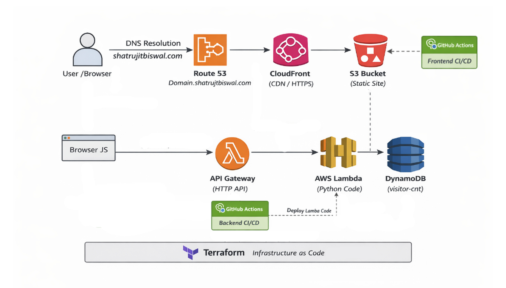

# Cloud Resume Challenge – AWS

This repository contains my implementation of the **Cloud Resume Challenge (AWS)**, built with an emphasis on **real-world cloud architecture, infrastructure ownership boundaries, CI/CD discipline, and production safety** rather than tutorial shortcuts.

🔗 **Live Website:** https://shatrujitbiswal.com  

---

## Overview

The project delivers a static resume website served securely over HTTPS and backed by a serverless visitor counter API.  
All infrastructure is provisioned using **Terraform**, while **application delivery** is handled separately using **GitHub Actions**.

Key goals of this implementation:
- Infrastructure as Code (IaC)
- Least-privilege IAM
- Clear separation of infra vs application delivery
- Production-safe CI/CD pipelines
- Realistic testing and debugging practices

---

## Architecture

### High-Level Components

**Frontend**
- Static resume (HTML, CSS, JavaScript)
- Hosted in a **private S3 bucket**
- Served via **CloudFront** (HTTPS, caching)
- Custom domain configured using **Route53**
- TLS certificate managed by **ACM**

**Backend**
- Visitor counter implemented using **AWS Lambda (Python)**
- Exposed through **API Gateway (HTTP API)**
- Counter stored in **DynamoDB**
- Atomic updates using `UpdateItem` with `if_not_exists`

**Infrastructure**
- All AWS resources managed with **Terraform**
- Existing production resources imported to prevent downtime
- IAM and DNS intentionally excluded from CI/CD

**CI/CD**
- Backend CI/CD deploys **Lambda code only**
- Frontend CI/CD deploys **static files only**
- Terraform is never executed inside CI

---

## Architecture Diagram


## Technology Stack

| Layer | Technology |
|-----|-----------|
| Frontend | HTML, CSS, JavaScript |
| Backend | Python (AWS Lambda) |
| API | Amazon API Gateway (HTTP API) |
| Database | Amazon DynamoDB |
| CDN | Amazon CloudFront |
| Storage | Amazon S3 |
| DNS | Amazon Route53 |
| IaC | Terraform |
| CI/CD | GitHub Actions |
| Testing | Pytest, unittest.mock |

---

## Repository Structure

```
.
├── backend
│   ├── handler.py
│   ├── requirements.txt
│   └── tests
│       ├── conftest.py
│       └── test_handler.py
├── frontend
│   ├── index.html
│   ├── script.js
│   ├── style.css
│   └── api_url.txt
├── terraform
│   ├── iam.tf
│   ├── lambda.tf
│   ├── api_gateway.tf
│   ├── dynamodb.tf
│   ├── s3.tf
│   ├── cloudfront.tf
│   ├── variables.tf
│   ├── outputs.tf
│   └── provider.tf
└── .github
    └── workflows
        ├── backend-ci-cd.yml
        └── frontend-ci-cd.yml
```

---

## Recreating This Project

### Clone the repository
```bash
git clone https://github.com/Shatrujit-Biswal/cloud-resume-challenge-aws.git
cd cloud-resume-challenge-aws
```

### Provision infrastructure
```bash
cd terraform
terraform init
terraform apply
```

### Capture API URL
```bash
terraform output -raw api_invoke_url > ../frontend/api_url.txt
```

---

## Inspiration

This project is inspired by the Cloud Resume Challenge:
https://cloudresumechallenge.dev/docs/the-challenge/aws/

---

## Author

**Shatrujit Biswal**  
https://shatrujitbiswal.com

---
